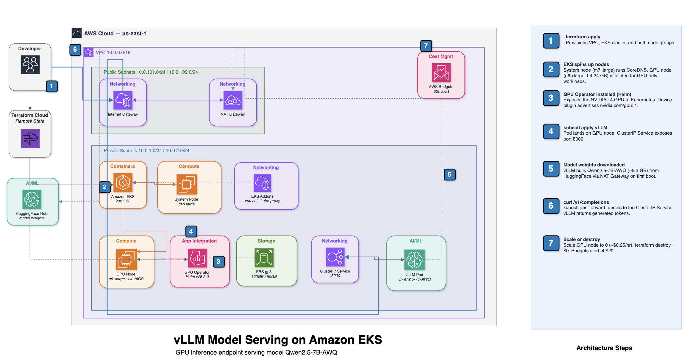

## Production-Grade LLM Serving with vLLM on Amazon EKS
(Terraform + NVIDIA GPU Operator)

Provision a GPU on **AWS EKS with Terraform**, installed the **NVIDIA GPU Operator**, and served
**Qwen2.5-7B-Instruct-AWQ** through **vLLM's OpenAI-compatible API**
i.e. a production-shaped model inference endpoint, reachable via `curl /v1/completions`.



This is the foundation project. 
Multi-model routing (#2) and GPU observability (#4) are built ultilizing the same cluster.

**Done when:** `curl .../v1/completions` returns tokens from a GPU node that Terraform created,
and I can read the GPU's memory usage and defend the `--gpu-memory-utilization` and
`--max-model-len` values I picked.
Those two flags are the KV-cache-vs-OOM tradeoff.

## What's actually being deployed

There is no app and no dataset here. The deliverable is an **inference API**: an HTTP endpoint that takes a prompt and returns generated text. 

Everything below exists to get one model onto one GPU and keep it serving.
This is the AI infrastructure engineer's job. Someone else trains the model and you deploy/serve the model.

| Layer | Tool | What it does here |
|---|---|---|
| Provisioning | **Terraform** | Declares the VPC, EKS cluster and GPU node as code. Reproducible, and destroyable in one command. |
| Orchestration | **Kubernetes (EKS)** | Schedules the serving container onto the GPU node, restarts it when it dies, handles networking. This is what makes it a service instead of a script. |
| GPU enablement | **NVIDIA GPU Operator** | Makes Kubernetes aware the GPU exists. Without it, the scheduler sees a plain machine and `nvidia.com/gpu` is never advertised. |
| Serving engine | **vLLM** | Loads the model onto the GPU and serves it. PagedAttention plus continuous batching are what make it fast. Exposes an OpenAI-compatible API. |
| Model | **Qwen2.5-7B-Instruct-AWQ** | The payload. AWQ is 4-bit quantized, so a 7B model fits on a 24 GB card with plenty of room left for KV cache. |
| Package manager | **Helm** | Installs the GPU Operator chart (roughly six components) in one go, via Terraform's `helm_release`. vLLM is *not* Helm here, just `kubectl apply`. |
| Test client | **curl** | Hits `/v1/completions`. That response is the checkpoint. |

## Why self-host instead of calling an API?
- Self-hosting wins on **cost-at-scale.
- Data/privacy - prompts stay in your VPC.
- Latency & model control- the ability to run whatever model you want.Scoped to this project alone — multi-model routing, GPU sharing, observability, canary,
cost/quant benchmarking, CI/CD, autoscaling and chaos hardening are already covered as
projects #2–#9.


## Open source Vs Closed source models
**Open source model** — weights are downloadable (Hugging Face, etc.). You get the actual parameter file, can run it on your own GPU, fine-tune it, inspect it, no per-token fee to a vendor. Examples: Llama, Qwen, Mistral, DeepSeek.

**Closed source model** — you only get an API endpoint (OpenAI's GPT, Anthropic's Claude, Google's Gemini). No weights, no self-hosting — you send a prompt over HTTPS and pay per token. The company keeps the model itself locked away. 

You can't self-host a closed model. There are no weights to put on a GPU

## Why Kubernetes

 Kubernetes earns its place on what comes after:

- **Scheduling** — GPUs become a countable resource (`nvidia.com/gpu: 1`), not just a machine.
- **Isolation** — taints and requests keep cheap pods off the expensive card and stop two containers fighting over one GPU.
- **Self-healing** — pod dies, it restarts behind a stable Service address.
- **Autoscaling** — HPA/KEDA on the pod, node group to zero between sessions.
- **Rollouts** — canary and blue/green are built-in primitives, not scripts.
- **Ecosystem** — GPU Operator, DCGM metrics, MIG/time-slicing all ship as Kubernetes components.
- **Portability** — same manifests on any cloud, which matters for a decentralized GPU platform.

EKS specifically: AWS runs the control plane, and the accelerated AMI ships the NVIDIA driver.

## Technologies locked:

- **AWS EKS**, provisioned by Terraform.
- **`Qwen/Qwen2.5-7B-Instruct-AWQ`** as the model. Ungated on Hugging Face, so no token to
  manage, and ~5–6 GB of weights.
- **The AMI ships the driver, not the Operator.** EKS's accelerated AMI
  (`AL2023_x86_64_NVIDIA`) already has the NVIDIA driver, so the GPU Operator runs with
  `driver.enabled=false`. It still owns the device plugin, DCGM exporter and time-slicing
  config, all of which later projects reuse. The alternative (letting the Operator install the
  driver) is officially unsupported on Amazon Linux 2023.
- **Helm for the Operator, raw YAML for vLLM.** A single Deployment doesn't need a chart, and
  editing YAML is faster than re-templating when you're iterating on engine flags.

## Hardware

1× **g6.xlarge** (NVIDIA L4, 24 GB VRAM, ~$0.805/hr, 100 GB gp3 root) for the model, plus
1× **m7i.large** CPU node so that CoreDNS and friends never land on the expensive card.

The L4 was sized from the model. Qwen2.5-7B in 4-bit AWQ is about 5.3 GB of weights, which leaves
roughly 13 GB of the 24 GB for KV cache once context and overhead are paid for.

## Pinned versions

| Component | Pin |
|---|---|
| Terraform | ≥ 1.5 |
| AWS provider | ~> 6.0 |
| terraform-aws-modules/vpc/aws | ~> 6.0 (single NAT) |
| terraform-aws-modules/eks/aws | ~> 21.0 |
| EKS cluster | 1.33 |
| GPU AMI type | `AL2023_x86_64_NVIDIA` |
| GPU instance | `g6.xlarge` (L4 24 GB), fallback `g5.xlarge` (A10G) |
| GPU Operator chart | v26.3.2, `driver.enabled=false`, `toolkit.enabled=false` |
| vLLM image | `vllm/vllm-openai:v0.22.1` (never `:latest`) |
| Model | `Qwen/Qwen2.5-7B-Instruct-AWQ` |

Pinning the vLLM image matters more than it looks. `:latest` changes engine defaults under you,
and then a config that worked yesterday OOMs today.

## Project Layout

```
vllm-serving-eks/
  terraform/
    versions.tf      # provider + module pins
    providers.tf     # aws, kubernetes, helm (helm authenticates through EKS)
    variables.tf     # region, cluster_version, gpu_instance_type
    vpc.tf           # terraform-aws-modules/vpc, single NAT gateway
    eks.tf           # EKS + system and GPU node groups
    gpu-operator.tf  # helm_release nvidia/gpu-operator
    outputs.tf       # cluster name + the update-kubeconfig command
  k8s/
    vllm-deployment.yaml  # Deployment + ClusterIP Service
  scripts/
    verify.sh             # the one verification entry point: wait -> port-forward -> curl -> nvidia-smi
    gpu-nodes-scaling.sh  # scale the GPU node group in/out (Terraform can't — see the script header)
```

The GPU Operator lives in Terraform so `terraform destroy` cleans it up with everything else.
vLLM stays as a plain manifest.

## Setup

You need AWS CLI, Terraform, kubectl and Helm locally, plus an approved GPU vCPU quota —
Full prerequisites and per-step checks in **[docs/setup.md](docs/setup.md)**.

## Build sequence

Each step has something to check before moving on.

1. **Quota.** Request EC2 "Running On-Demand G and VT Instances" ≥ 8 vCPU.
   *Check:* Service Quotas shows the applied quota. **This is the number one blocker. New
   accounts sit at 0, and approval takes anywhere from minutes to two days.**
2. **`terraform apply`** for VPC, EKS and both node groups.
   *Check:* `aws eks update-kubeconfig …`, then `kubectl get nodes` shows 1 system + 1 GPU node
   `Ready`.
3. **Taint and label** on the GPU node.
   *Check:* `kubectl describe node <gpu-node>` shows the taint and `workload=gpu`.
4. **GPU Operator** settles (it installed itself during step 2).
   *Check:* `kubectl -n gpu-operator get pods` is healthy and the node advertises
   `nvidia.com/gpu: "1"`. If that number never appears, look at DaemonSet tolerations first.
5. **`kubectl apply -f k8s/vllm-deployment.yaml`.**
   *Check:* the pod schedules on the GPU node rather than sitting `Pending`, the logs show the
   KV cache line, and `/health` returns 200.
6. **Verify.** One entry point — `bash scripts/verify.sh` — which waits for the pod (up to 15 min,
   because first boot pulls ~11 GB and loads weights), opens the port-forward itself, POSTs to
   `/v1/completions`, then runs `nvidia-smi` in the pod and greps the KV-cache lines out of the
   startup logs. It echoes every command before running it and exits non-zero on failure.
   *Check:* it ends with `✅ Project verification complete.` If you'd rather do it by hand:
   ```bash
   kubectl port-forward svc/vllm 8000:8000
   curl localhost:8000/v1/completions -H "Content-Type: application/json" -d '{"model":"Qwen/Qwen2.5-7B-Instruct-AWQ","prompt":"Hello, my name is","max_tokens":20}'
   kubectl exec deploy/vllm -- nvidia-smi
   ```
   Optionally curl the DCGM exporter for `DCGM_FI_DEV_FB_USED` as a preview of project 4.
   *Check:* tokens come back, and the VRAM number lines up with the math above.
7. **Turn it off.** `bash scripts/gpu-nodes-scaling.sh in` scales the GPU group to 0 if you're
   back tomorrow (`out` brings it back); `terraform destroy` if you're done.
   *Check:* `kubectl get nodes` shows no GPU node.

## Cost

Per component, us-east-1 on-demand:

| Component | $/hr |
|---|---|
| EKS control plane | 0.10 |
| GPU node `g6.xlarge` (L4) | ~0.805 (`g5.xlarge` is ~1.006) |
| System node `m7i.large` | ~0.10 |
| NAT gateway (single) | ~0.045 plus ~$0.045/GB |
| EBS gp3 (100 GB + ~20 GB) | ~$0.013/hr, about $10/mo |

Three states are worth remembering:

| State | ~$/hr | What's running |
|---|---|---|
| **Active** | **~$1.05** | Everything. The only state where the GPU bills. |
| **GPU scaled to 0** | **~$0.25** (~$6/day) | Control plane, system node, NAT, EBS. |
| **Destroyed** | **$0** | Nothing. |

In practice: a focused 5–8 hour session runs **$6–9**. Leaving it scaled to zero overnight is
**not free**, it's about $6/day, so destroy it if you're away for more than a day. Leaving the
whole thing up for a month is roughly **$780**, of which the GPU alone is $588. Destroy between
sessions and the entire project lands somewhere around **$15–30**.

## Guardrails

- `min_size = 0` on the GPU group, so scaling to zero is always available.
- `terraform destroy` is the only true $0 state. It's the one that also kills the control plane
  and NAT gateway.
- Tag everything `project=vllm-serving-eks` and set a **$20 AWS Budgets alert**. The alert is
  the backstop for the night you forget.

## Before you start

- **AWS credentials.** `aws sts get-caller-identity` should work, and the GPU vCPU quota from
  step 1 must be approved. The quota gates everything else.
- **Region.** Default is `us-east-1`. Switch if you hit `InsufficientInstanceCapacity` on g6/g5.
- **g6 vs g5.** g6.xlarge (L4) is the default and the cheaper card. g5.xlarge (A10G) is the
  one-variable fallback if capacity or quota doesn't line up.

## Future Enhancements

- **External access.** Replace `port-forward` with an AWS Load Balancer Controller (ALB/NLB)
  or Ingress + TLS, so the endpoint is reachable without a live `kubectl` session.
- **Model weight caching.** Back the model cache with an EBS or EFS persistent volume so the
  ~11 GB download doesn't repeat every time a pod restarts or the GPU node scales back up
  from zero.
- **Centralized logging.** Ship vLLM and node logs to CloudWatch Logs (or similar) instead of
  relying on `kubectl logs`, which disappears with the pod.
- **HA / multi-AZ.** Currently single NAT gateway, single-AZ node groups — fine for a demo,
  not for anything that needs to survive an AZ outage.
