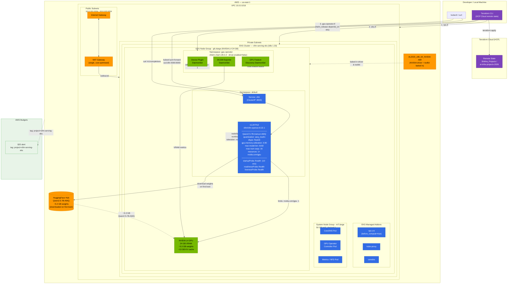

# Architecture Diagram — vLLM Serving on EKS



---

## Component Summary

| Layer | Component | Detail |
|---|---|---|
| **Provisioning** | Terraform + HCP Cloud | Declares all infra as code; remote state in Terraform Cloud |
| **Network** | VPC `10.0.0.0/16` | 2 private subnets (nodes) + 2 public subnets; single NAT gateway |
| **Orchestration** | EKS 1.33 | Managed control plane; nodes in private subnets only |
| **EKS Addons** | vpc-cni / kube-proxy / coredns | Explicitly declared (v21 module doesn't install these by default) |
| **System Node** | `m7i.large` — desired 1 | Runs CoreDNS, GPU Operator controller, metrics; keeps them off the GPU node |
| **GPU Node** | `g6.xlarge` (NVIDIA L4 24 GB) — min 0 / max 2 | Tainted `nvidia.com/gpu=present:NoSchedule`; scale-to-zero for cost control |
| **GPU Operator** | Helm chart v26.3.2 | Device plugin + DCGM exporter + GFD; driver/toolkit disabled (baked into AMI) |
| **Serving Engine** | vLLM `v0.22.1` | OpenAI-compatible API on `:8000`; PagedAttention + continuous batching |
| **Model** | `Qwen2.5-7B-Instruct-AWQ` | 4-bit AWQ → ~5.3 GB weights, ~13 GB KV cache on L4 |
| **Access** | ClusterIP Service + `kubectl port-forward` | No public load balancer; developer access only |

## Cost States

| State | ~$/hr | Running |
|---|---|---|
| **Active** | ~$1.05 | Everything |
| **GPU scaled to 0** | ~$0.25 | Control plane + system node + NAT + EBS |
| **Destroyed** | $0 | Nothing |
```
